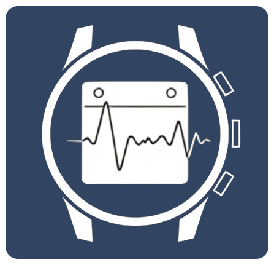
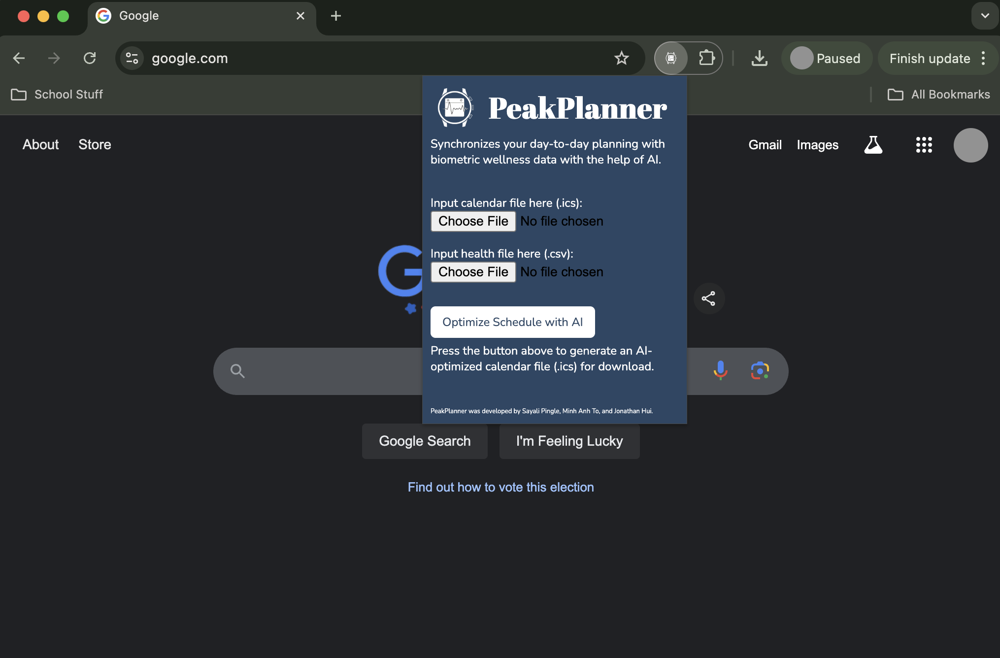

# LLM-Based Schedule Optimizer - PeakPlanner

PeakPlanner is a smart scheduling tool that helps you plan work and study tasks around your health and productivity. By analyzing data like your sleep, energy levels, menstrual cycles, and productivity patterns, PeakPlanner automatically schedules your important tasks at times when you’re at your best. This way, you don’t need to plan your week manually, but you’ll still meet your high-priority deadlines without sacrificing well-being.

With PeakPlanner, managing your schedule is effortless. Instead of manually adding tasks or adjusting time blocks to handle multiple deadlines, PeakPlanner organizes everything for you. Just enter your deadlines, and PeakPlanner takes care of the rest—it even prioritizes rest on low-energy days and assigns your most productive times for key tasks. Enjoy staying on top of your priorities with a balanced, productive routine, without the hassle of manual planning.

## Key Features

### Optimal Time Block Suggestions
    
PeakPlanner intelligently integrates both health data (e.g., sleep, productivity, menstrual cycles, energy levels, etc) and schedule data (e.g., deadlines, fixed events) to suggest the best time blocks for high-priority tasks. The system aligns important deadlines with times when you are naturally more alert and focused, preventing last-minute stress and maximizing efficiency.

### Task Tracking and Habit Formation:

Each day, PeakPlanner prompts you to log task completion, allowing it to track your habits and time spent. This feedback loop helps refine its suggestions, enabling smarter adjustments based on your real-world performance and fostering better time management habits.

## How To Use

With a simple web extension, PeakPlanner can be seamlessly integrated into your existing calendar, making the optimization process smooth and intuitive. Simply add your calendar and sync your health data, and you’ll be able to view your optimized schedule directly within your preferred calendar interface. This integration ensures that your most productive schedule is always just a click away.

## Future Enhancements

### Advanced Health Data Integration

Add tracking for more health metrics, such as exercise routines and physical activity levels, to provide even more tailored scheduling insights.

### Expanded Scheduling Options

Integrate with local event data, along with gym sessions and meditation blocks, for a well-rounded approach to personal time management.

### Peak Productivity Insights

Introduce features to predict and highlight peak productivity windows, allowing you to plan high-priority work around your most effective times.
