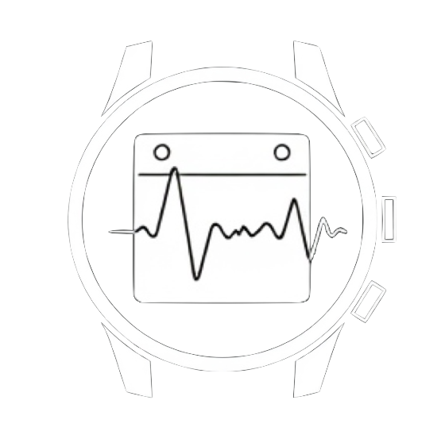

# LLM-Based Schedule Optimizer - PeakPlanner

PeakPlanner is a smart scheduling solution that uses advanced language model (LLM) capabilities to create an optimized work and study plan tailored to your health and productivity rhythms. By analyzing personal metrics such as sleep quality, energy levels, menstrual cycles, and productivity patterns, PeakPlanner schedules your most critical tasks during times when you’re naturally at your best. This approach eliminates the need for manual planning while ensuring high-priority deadlines are met without sacrificing your well-being.

Designed for convenience, PeakPlanner takes the work out of planning. Rather than manually adding tasks or adjusting time blocks to juggle multiple deadlines, the LLM model intelligently organizes your schedule with minimal effort on your part. Simply input your deadlines, and PeakPlanner takes care of the rest—dynamically adapting to prioritize rest on low-energy days and reserving your most productive hours for important tasks. With PeakPlanner, you can effortlessly stay on top of your priorities, enjoying a balanced, productive lifestyle without the hassle of manual planning.

## Key Features

### Optimal Time Block Suggestions
    
PeakPlanner intelligently integrates both health data (e.g., sleep, productivity, menstrual cycles, energy levels, etc) and schedule data (e.g., deadlines, fixed events) to suggest the best time blocks for high-priority tasks. The system aligns important deadlines with times when you are naturally more alert and focused, preventing last-minute stress and maximizing efficiency.

### Task Tracking and Habit Formation:

Each day, PeakPlanner prompts you to log task completion, allowing it to track your habits and time spent. This feedback loop helps refine its suggestions, enabling smarter adjustments based on your real-world performance and fostering better time management habits.

## Future Enhancements

### Advanced Health Data Integration

Add tracking for more health metrics, such as exercise routines and physical activity levels, to provide even more tailored scheduling insights.

### Expanded Scheduling Options

Integrate with local event data, along with gym sessions and meditation blocks, for a well-rounded approach to personal time management.

### Peak Productivity Insights

Introduce features to predict and highlight peak productivity windows, allowing you to plan high-priority work around your most effective times.